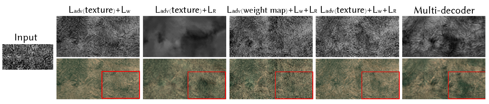

# Generating Massive Landscape through Multi-layer Texture Mapping using Differentiable Rendering

### The experimental results on 512×1024 images

 Results of proposed stitching models, and image stitching methods. The first column is the texture with seam. The red box in the lower right corner is the magnified view for specific areas.

Results of the proposed method, inpainting and outpainting methods. The first column is the sample texture, while
the second column is the target terrain.

Ablation experiments for weight map synthesis model, including different loss functions, decoder branches, and
discriminator inputs. The red box in the lower right corner is a magnified view of a specific area.

### The experimental results on 1024×2048 images

Pictures below present the qualitative experimental results on 1024×2048 images. The 512×1024 images presented above are cropped from these 1024×2048 images for demonstration purposes.

| Model |Image1|
|:--------:|:--------:|
| S        |  |
| GC       |  |
| EC       |  |
| GraphCut |  |
| Seam2Cont |  |
| Ours     |  |

| Model |Image2|
|:--------:|:--------:|
| S        |  |
| GC       |  |
| EC       |  |
| GraphCut |  |
| Seam2Cont |  |
| Ours     |  |

| Model |Image3|
|:--------:|:--------:|
| S        |  |
| GC       |  |
| EC       |  |
| GraphCut |  |
| Seam2Cont |  |
| Ours     |  |
