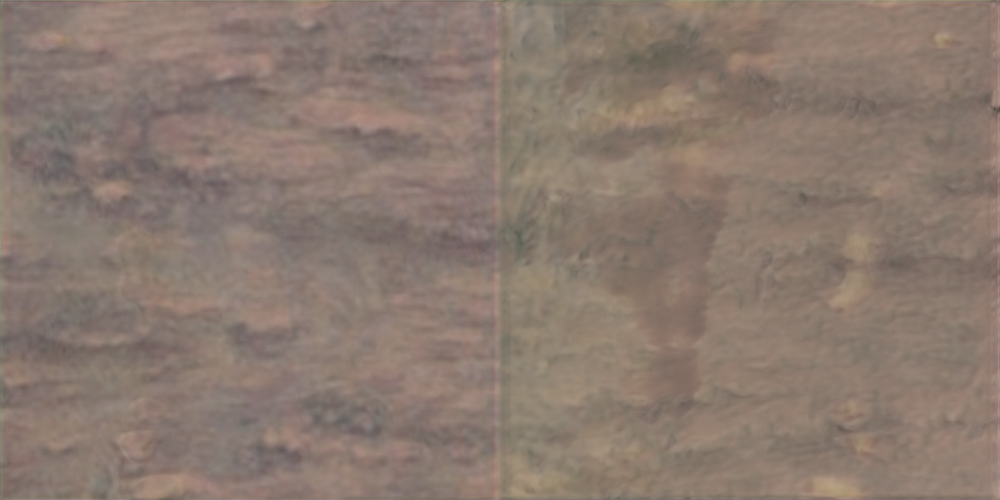

# Landscape Appearance Construction via Differentiable Rendering Based Terrain Weight Map Synthesis

### The 3D terrain scenes using our method

Results of the 3D terrain scenes we constructed. As can be seen, there is a significant difference in texture resolution before and after using the weight map.
  

### The texture splatting technique for Large-Scale Terrain Rendering

To inherit the advantage of deep leaning based methods, and provide more surface details close to observer with acceptable hardware overhead, we introduce the texture splatting.

<table align="center" width="55%">
  <tr>
    <td align="left">w/ Texture Splatting</td>
    <td align="right">w/o Texture Splatting</td>
  </tr>
</table>

### The experimental results on 512×1024 images

 Results of proposed stitching models, and image stitching methods. The first column is the texture with seam. The red box in the lower right corner is the magnified view for specific areas.

### The experimental results on 1024×2048 images

Pictures below present the qualitative experimental results on 1024×2048 images. The 512×1024 images presented above are cropped from these 1024×2048 images for demonstration purposes.

| Model |Image1|
|:--------:|:--------:|
| S        |  |
| GC       |  |
| EC       |  |
| GraphCut |  |
| Seam2Cont |  |
| Ours     |  |

| Model |Image2|
|:--------:|:--------:|
| S        |  |
| GC       |  |
| EC       |  |
| GraphCut |  |
| Seam2Cont |  |
| Ours     |  |

| Model |Image3|
|:--------:|:--------:|
| S        |  |
| GC       |  |
| EC       |  |
| GraphCut |  |
| Seam2Cont |  |
| Ours     |  |

### Comparative Overview of Image Processing Results

Results of the proposed method, inpainting and outpainting methods. The first column is the sample texture, while the second column is the target terrain.

### Detailed Visual Overview of Image Processing Results

The following images provide a detailed visual overview of the aforementioned images. The comparison images from the ReGo experiment have a resolution of 1024x512, while the resolutions of the other images being compared are 1024x1024.
| Model |Image1|
|:--------:|:--------:|
| GC       |  |
| EC       |  |
| ReGo | |
| Ours     |  |

| Model |Image2|
|:--------:|:--------:|
| GC       |  |
| EC       |  |
| ReGo |  |
| Ours     |  |

| Model |Image3|
|:--------:|:--------:|
| GC       |  |
| EC       |  |
| ReGo |  |
| Ours     |  |

| Model |Image4|
|:--------:|:--------:|
| GC       |  |
| EC       |  |
| ReGo |  |
| Ours     |  |

| Model |Image5|
|:--------:|:--------:|
| GC       |  |
| EC       |  |
| ReGo |  |
| Ours     |  |

| Model |Image6|
|:--------:|:--------:|
| GC       |  |
| EC       |  |
| ReGo |  |
| Ours     |  |
